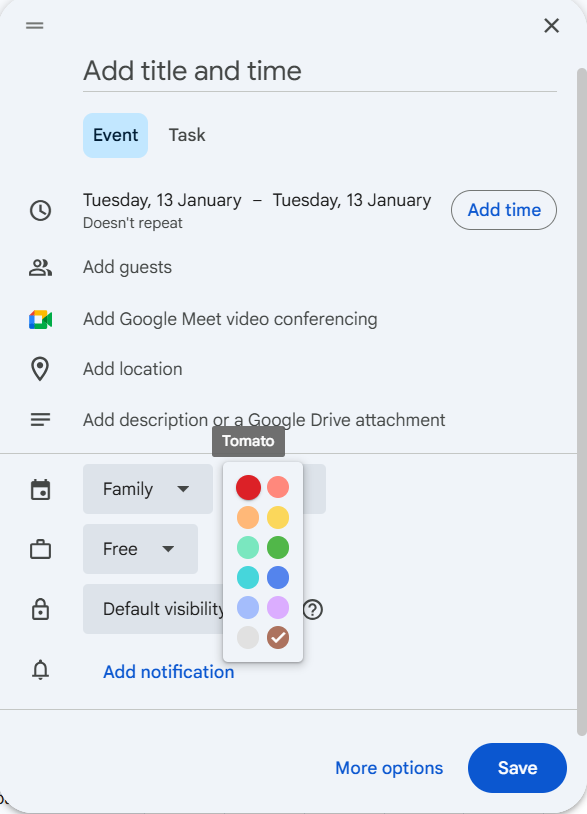

# Google Calendar Resources and References

## Functions

* **save_event** -
* **delete_event** -

## Events Colours

**Colour Map Between Calendar API (v3) and CalendarApp Service**

| Color ID | Sample | Calendar UI Label | Enum Property | Hex Code | 
|:--------:|:------:|:-----------------:|:-------------:|:--------:|
|  1 | $${\color{#A4BDFC}██████}$$ | Peacock | PALE_BLUE | #A4BDFC |
|  2 | $${\color{#7AE7BF}██████}$$ | Sage | PALE_GREEN | #7AE7BF |
|  3 | $${\color{#DBADFF}██████}$$ | Grape | MAUVE | #DBADFF |
|  4 | $${\color{#FF887C}██████}$$ | Flamingo | PALE_RED | #FF887C |
|  5 | $${\color{#FBD75B}██████}$$ | Banana | YELLOW | #FBD75B |
|  6 | $${\color{#FFB878}██████}$$ | Tangerine | ORANGE | #FFB878 |
|  7 | $${\color{#46D6DB}██████}$$ | Lavender | CYAN | #46D6DB |
|  8 | $${\color{#E1E1E1}██████}$$ | Graphite | GRAY | #E1E1E1 |
|  9 | $${\color{#5484ED}██████}$$ | Blueberry | BLUE | #5484ED |
| 10 | $${\color{#51B749}██████}$$ | Basil | GREEN | #51B749 |
| 11 | $${\color{#DC2127}██████}$$ | Tomato | RED | #DC2127 |

* [Enum EventColor](https://developers.google.com/apps-script/reference/calendar/event-color) - named event colours as used in CalendarApp service
* [Colors](https://developers.google.com/workspace/calendar/api/v3/reference/colors) - resource representation from Calendar API v3

